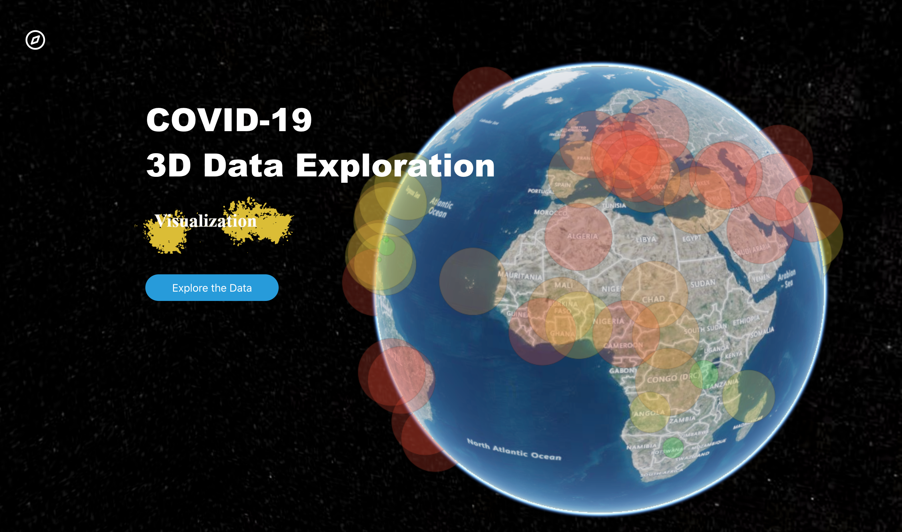
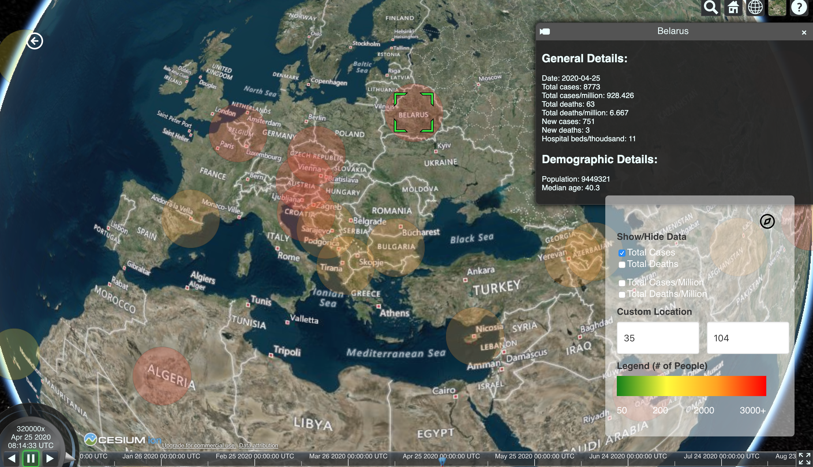

# COVID-19 3D Data Visualizer

The tool is a web application that display COVID-19 data by country from December 31, 2019, namely the number of cases,
deaths, cases per million, and deaths per millions. It allows users to view the data on a timeline, click on data points
to learn more about a country's status, and zoom into certain regions (both by name and by latitude and longitude). 
This project was submitted to the TecHacks 2020 hackathon created over a weekend.

## Technologies Used

This project was built using:
- [Cesium/Resium](https://resium.darwineducation.com/): Cesium is a powerful open-source Javascript library for creating world-class, high-performant 3D maps. The base of the project utilizes this tool, which enables for a unique data format called czml to show time-dependent geospatial data. Resium is the React component library for Cesium. 
- [React](https://reactjs.org/): The frontend of this project is done entirely in React.
- [Bulma](https://bulma.io/): The CSS framework.
- [czml-writer](https://github.com/AnalyticalGraphicsInc/czml-writer/wiki/CZML-Guide): The data format I used was czml, which is unique to the Cesium engine. It's a JSON file format for displaying time-dynamic data in the browser.
- Google Sheets' [geocode](https://willgeary.github.io/data/2016/11/04/Geocoding-with-Google-Sheets.html) function to turn countries into latitude and longitude.
- And finally, last but not least, [dataset](https://github.com/owid/covid-19-data/tree/master/public/data) from Our World in Data.

## Demos

### Welcome Page

### Visualizer

### Timelapse

## Relevant links
This project was bootstrapped with [Create React App](https://github.com/facebook/create-react-app).
A live demo of the project can be found [here](https://dzungpng.github.io/covid19-data-visualization/).
See the project on Devpost [here](https://devpost.com/software/covid-19-3d-visualizer).